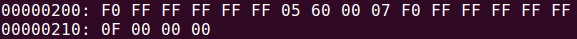
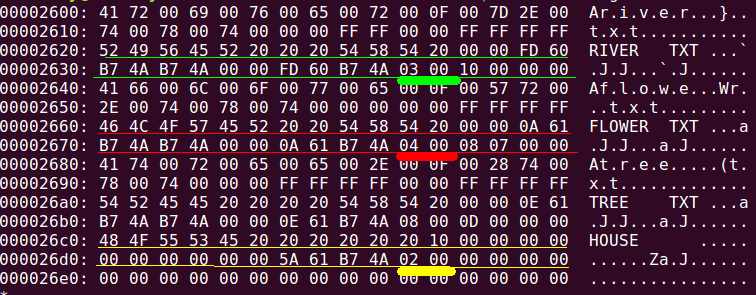
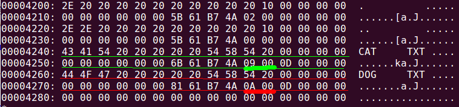

# 实验: 在FAT12文件系统中如何定位一个文件

根据FAT12缺省设置, 引导扇区占完全占据第0扇区, 共512字节, FAT1紧随其后, 所在偏移为0x200:

注: FAT表可能不止一个, FAT表的数量在引导扇区偏移0x10处用1字节整数表示. 如图显示有2个FAT表, FAT2可看做是FAT1的备份:

根目录区位于第19扇区, 一个扇区512字节, 因此根目录区的第一字节的偏移为19×512=0x2600:

根目录区条目的格式:

river.txt的首簇为3, 查看FAT表知, 簇3对应的簇号为结束标志0xFFF, 说明river.txt只占用了簇3. 下面定位到文件内容:

根据书中的分析, 数据区开始扇区号为33, 偏移为33×512=0x4200. 由于簇0和簇1没有分配文件数据, 从簇2才开始分配, 而簇0和簇1也没有在数据区占据任何空间, 因此簇3是数据区第2簇(从1开始编号), 簇3的第1字节相对数据区起始的偏移为(3-2)*512=0x200, 文件偏移为0x4200+0x200=0x4400, 查看该处的内容, 确实为river.txt的文件数据:

flower.txt包含300个"flower", 首簇号为4, 查看FAT表可知占据了4,5,6,7簇. 簇4的偏移为(4-2)×512+0x4200=4600:

目录HOUSE/位于簇2, 偏移为(2-2)×0x4200=0x4200:

可以看到HOUSE/下有两个文件CAT.TXT和DOG.TXT, 文件数据所在簇号分别为9和0xA, 以cat.txt为例, 同样可以查看到文件数据:

